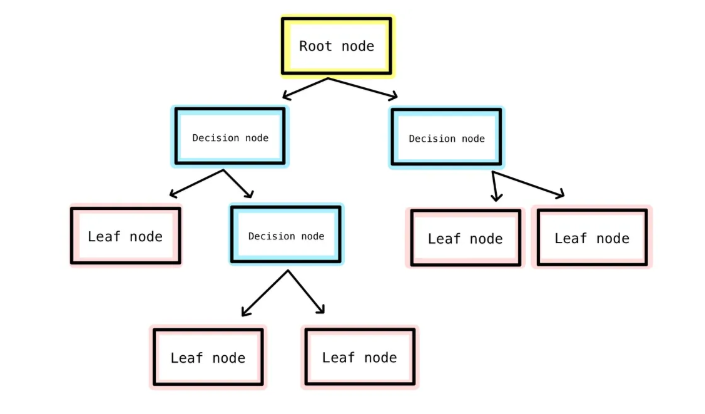

# Decision_Trees_Job_ApplicatioEvaluation of Job Applications with Artificial Intelligence with Decision Trees

<h2>Decision Tree</h2>

Decision tree is actually very intuitive and easy to understand. It is basically a set of Yes/No or if/else questions. Below is a typical diagram of decision tree.

Root node is either the topmost or the bottom node in a tree. bare nodes where the flow branches into several optional flows, and most importantly, leaf nodes are the end nodes with the final output.

Along with this, another advantage of decision tree is that influences of feature scaling or regularization are not as huge as other models. However, at the same time, there is one major drawback of decision tree which is that it is subject to overfitting. For this reason, setting tree parameters before running the model is very important.

